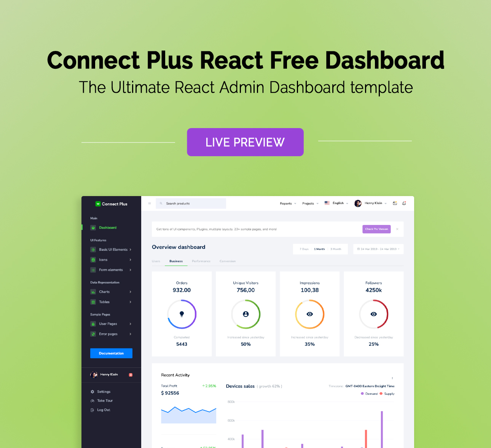

## Connect Plus React - Free Admin Template
Presenting Connect Plus React Free, a free beautiful, and easy-to-use admin template with a striking color theme, built with React JS. It comes packed with features and doesn’t feel cramped with too much information. It is an excellent fit to build admin panels, e-commerce systems, project management systems, CMS or CRM.

Although the template has a design like none other, it is easily customizable to suit your requirements. Connect Plus React comes with a clean and well-commented code that makes it easy to work with the template. Thus making it an ideal pick for jump-starting your project.

### Demo
Click the image below to get a live preview.
[](https://bootstrapdash.com/demo/connect-plus-react-free/template/demo_1/preview/dashboard)


### Credits

- Bootstrap
- Material Design Icons
- React
- Chart.js

### Browser Support

- Chrome (latest)
- FireFox (latest)
- Safari (latest)
- Opera (latest)
- IE10+

### License Information

Connect Plus React free is released under MIT license. This is a free react admin template developed by BootstrapDash. Feel free to download it, use it, share it, and get creative with it.
  
## Like what you see?
Within the download you'll find the following directories and files, logically grouping common assets and providing both compiled and minified variations. You'll see something like this:

```
connect-plus-react-free-admin-template/
  ├── template
    ├── demo_1
        ├── src/
            ├── app/
            ├── assets/
                ├── images/
                ├── styles/
            ├── index.js
        ├── public/
        ├── .gitignore
        ├── package.json
  ├── CHANGELOG.md
  ├── documentation
  ├── LICENSE
  ├── README.md
```

## How to use Connect Plus React Free?

- Click the Clone or Download button in GitHub and download as a ZIP file or you can enter the command
$ git clone https://github.com/BootstrapDash/connect-plus-react-free-admin-template.git in your terminal to get a copy of this template.

- After the files have been downloaded you will get a folder with all the required files

- You can install all the dependencies in the template by running the command 'npm install'. All the required files are in the node modules.
You can serve the template with the command 'npm start'.

- Now that your project has now kick-started, all you need to do now is to code, code, and code to your heart's content.


## How to Contribute?

We love your contributions and we welcome them wholeheartedly. We believe the more the merrier. To contribute make sure you have Node.js and npm installed.

## Next
After node and npm have been installed, follow the steps below to contribute.

- Fork and clone the repo of connect-plus-react-free-admin-template.
- Run the command 'npm install' to install all the dependencies.
- Enter the command 'npm start'. This will open connect-plus-react-free-admin-template in your default browser.
- Make your valuable contribution
- Submit a pull request.


Do you need a template with more features and functionalities? Get more with our collection of premium templates with more plugins, eye-catching animations, UI components, and sample pages all fitting together with a high-quality design. Visit https://www.bootstrapdash.com for more admin templates.

